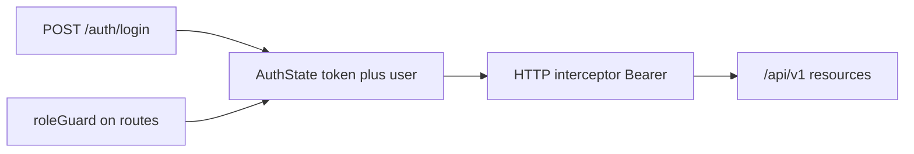

# Angular 20 + PrimeNG frontend plan (aligned with management backend)

## Version choice (Angular 20, not 21)

- Use **Angular 20** as the target: it sits on the **LTS-aligned** release line you want for production, and **third-party libraries** (PrimeNG, icon packs, etc.) are widely published and tested against **Angular 20** / **PrimeNG 20**.
- Pair with **PrimeNG 20** + **@primeuix/themes** at versions documented for that major (see [PrimeNG migration](https://primeng.org/migration/v20)). When Angular 21 and the wider ecosystem mature, plan a deliberate `ng update` + PrimeNG major bump.

## Backend contract (source of truth)

- **Base URL**: `{origin}/api/v1` (see [src/routes/index.ts](../../src/routes/index.ts) mounting `v1` under `/api`).
- **Success envelope** ([src/utils/apiResponse.ts](../../src/utils/apiResponse.ts)): `{ data, message, success: true, statusCode }`.
- **Error envelope**: `{ data: null, message, success: false, statusCode, code?, details? }`.
- **Auth**: `POST /auth/login` and `POST /auth/register` are **unauthenticated**; everything after `v1Router.use(authenticate)` in [src/routes/v1/index.ts](../../src/routes/v1/index.ts) requires `Authorization: Bearer <jwt>`.
- **Login/register payload** ([src/controllers/authController.ts](../../src/controllers/authController.ts)): response `data` is `{ user: { id, email, name, role }, token }`. JWT payload includes `sub` and `role` ([src/services/authService.ts](../../src/services/authService.ts)).
- **Roles** ([src/constants/roles.ts](../../src/constants/roles.ts)): `super_admin`, `admin`, `branch_admin`, `building_admin`, `booking_admin`, `employee_admin`, `front_desk`, `housekeeping`, `staff`.
- **Important**: Branch/building **scope** is enforced on the server via `authRoleAssignment` ([src/middleware/authenticate.ts](../../src/middleware/authenticate.ts), [src/services/rbacService.ts](../../src/services/rbacService.ts)). The login response does **not** include assignment IDs; lists are already filtered (e.g. [src/controllers/branchController.ts](../../src/controllers/branchController.ts)). The UI must still handle **403** on detail routes when scope does not allow access.

## 1. Project bootstrap

- Create a new workspace (sibling repo or `client/` next to the backend—your choice).
- **Angular 20** + **PrimeNG 20** + **@primeuix/themes** (per [PrimeNG v20 migration](https://primeng.org/migration/v20)): configure `providePrimeNG` with a preset (e.g. Aura), and global styles for theme + layout.
- **Default skip tests for components**: set schematics so new components omit `spec.ts`, e.g. in `angular.json` under `schematics` → `"@schematics/angular:component": { "skipTests": true }` (and same for directive/pipe if desired). Alternatively pass `--skip-tests` on every `ng generate`.
- **Strict TypeScript**, **standalone** components (current default for new Angular apps).

## 2. Production-style folder structure

Under `src/app/`:

| Area          | Responsibility                                                                                                                                                                         |
| ------------- | -------------------------------------------------------------------------------------------------------------------------------------------------------------------------------------- |
| **core/**     | Singleton services used once: `AuthService`, `TokenStorage`, `ApiConfig`, HTTP `authInterceptor`, `errorInterceptor`, functional `authGuard`, `roleGuard`, `APP_INITIALIZER` if needed |
| **shared/**   | Dumb/reusable UI: loading shell, confirm dialog wrapper, empty state, form field helpers; **no** feature-specific API calls                                                            |
| **layout/**   | SaaS app shell: collapsible sidebar, top bar, main scroll area, auth layout (see §3)                                                                                                   |
| **features/** | One folder per domain, each with **routes** + **pages** + **components** (all `.ts` / `.html` / `.scss`, no `spec.ts`)                                                                 |

Suggested **feature** modules mirroring [src/routes/v1/index.ts](../../src/routes/v1/index.ts):

- `features/auth` — login, register (bootstrap only when API allows)
- `features/users` — `/users`
- `features/property` — branches, buildings, floors, room-types, rooms, beds (sub-routes or child routes)
- `features/guests`
- `features/stays` — stays + folio sub-views (`/stays/:id/folio`, charges, close)
- `features/hr` — employees, attendance, leave-requests
- `features/audit` — audit-logs
- `features/rate-plans`

**Models**: `src/app/core/models/` or `src/app/shared/models/` — TypeScript interfaces for API envelopes and entities. Prefer generating shapes from backend usage: start with envelope + `User`, `Guest`, `Branch`, etc., and extend as you implement each screen ([src/models/*.ts](../../src/models) and Zod schemas in [src/validation/schemas.ts](../../src/validation/schemas.ts) are good references for field names).

**API layer**: thin services in `core/services/api/` or per-feature `*.service.ts` that call `HttpClient` and return **typed** `data` (unwrap envelope in one place).

## 3. Design system and modern SaaS layouts

Target a **contemporary B2B SaaS** look: calm surfaces, one strong primary accent, clear hierarchy, and predictable chrome—similar to Linear, Notion admin, or Stripe Dashboard patterns (without copying proprietary assets).

### 3.1 Authenticated app shell (`layout/`)

- **Grid**: CSS grid or flex — fixed **left sidebar** (width ~260px expanded, ~64px icon-only collapsed), fluid **main column** with internal padding; **top bar** full width above content (sticky optional).
- **Sidebar**: Logo + product name at top; **grouped navigation** (e.g. Overview, Operations, Property, Stays, People, Finance, System) using SVG icons + labels; `routerLinkActive` for active item (tinted background or left accent bar). Support **collapse toggle** and, below ~1024px, **overlay drawer** (PrimeNG `Drawer` or custom) with hamburger in top bar.
- **Top bar**: Height ~56–64px; subtle bottom border or shadow. Left: sidebar toggle (mobile/collapsed). Center/right: optional global search (placeholder for phase 2), **user menu** (avatar circle + name, `p-tieredMenu` or `p-menu` popup) with profile/logout. Reserve space for future **branch/building** context selector.
- **Content frame**: Top **page header** row — title + short subtitle or breadcrumb; **primary action** (e.g. “Add guest”) right-aligned. Below, **scrollable main** with consistent horizontal padding (e.g. 1.5–2rem).
- **Shared primitives** (in `shared/`): `PageHeaderComponent`, optional `EmptyStateComponent`, `LoadingSkeletonComponent` using `p-skeleton` for table rows.

### 3.2 Auth layout (login / register)

- **Full-viewport** centered **card** on a subtle background (soft gradient, noise, or low-contrast pattern via CSS—no stock photo dependency).
- Card: logo, title, form fields, primary submit; link to register only when API allows bootstrap registration.
- Keep **single column** on mobile; optional **split panel** on large desktop (brand panel left, form right) if you want a stronger SaaS marketing feel.

### 3.3 Visual language and tokens

- **PrimeNG preset**: Prefer **Aura** (or Lara) with **light** default; define semantic **CSS variables** in `styles/_variables.scss` for surface, border, text primary/muted, and accent—map where possible to Prime theme tokens so components stay cohesive.
- **Typography**: One quality **UI font** (e.g. via Google Fonts) for headings + body, or clean system stack; scale — page title ~1.25–1.5rem semibold, section ~1rem semibold, body ~0.875–1rem, helper/muted ~0.8125rem with reduced opacity.
- **Spacing**: **8px grid** in SCSS variables; card padding 1.25–1.5rem; use flex/grid `gap` for stacks instead of ad-hoc margins.
- **Surfaces**: Main app background slightly off-white (`#f8fafc` class of neutrals); **cards** white with **subtle border** (`1px`) or very light shadow; sidebar slightly different surface than main for separation.
- **Density**: Comfortable defaults for forms and tables; avoid cramming—SaaS users expect scan-friendly tables with clear row hover.

### 3.4 Feature page patterns (lists and forms)

- **List pages**: `p-card` wrapping a **toolbar** (search, filters, export placeholder) + **PrimeNG Table** with striped or hover rows, paginator, empty state when no data.
- **Create/edit**: `p-card` sections or stepped `p-panel` for long forms; `p-fluid` + responsive grid (`p-inputtext`, `p-select`, `p-datepicker`); sticky footer bar with Cancel / Save on wide forms optional.
- **Detail pages**: Header with entity title + status badge + actions; tabs (`p-tabView`) only when multiple sub-views (e.g. stay + folio) warrant it.
- **Feedback**: Toasts top-right for success/error; **ConfirmDialog** for destructive actions; inline field errors from API `details` when present.

### 3.5 Responsive behavior

- **Narrow viewports (under ~1024px)**: Sidebar → drawer; top bar compresses (icon-only actions); tables may **horizontal scroll** inside a rounded container or hide low-priority columns (phase 2).
- Touch targets ≥ 44px for mobile nav controls.

### 3.6 Global styles layout

- `src/styles.scss` — Prime theme imports + global resets.
- `src/styles/_variables.scss` — colors, spacing, radii, sidebar widths.
- `src/styles/_layout.scss` — shell grid, `.app-shell`, `.content-main` utilities.
- Feature `**.component.scss`** — page-specific tweaks only; avoid duplicating token values.

## 4. HTTP client and typing

- **ApiService** or interceptors: normalize responses so components receive `T` from `response.data`, and errors map `message` / `details` to PrimeNG `MessageService` or a toast wrapper.
- **Environment**: `apiUrl: 'http://localhost:3000/api/v1'` (dev) / production URL.
- **CORS**: backend already uses `cors()` in [src/app.ts](../../src/app.ts); no change required for local dev.

## 5. Role-based access to URLs

- Persist **token** (memory + optional `sessionStorage` or `localStorage`—document tradeoff) and **user** (at least `role`, `id`, `email`, `name`).
- **authGuard**: redirect unauthenticated users to `/login` for all private routes.
- **roleGuard**: read allowed roles from route `data`, e.g. `data: { roles: ['super_admin','admin'] as const }`, compare to `user.role`.
- Maintain a **single route–role matrix** in frontend that mirrors backend `requireRoles` / `requireAuthUser` patterns (grep reference: [guestController](../../src/controllers/guestController.ts), [branchController](../../src/controllers/branchController.ts), [userAdminController](../../src/controllers/userAdminController.ts), etc.). Examples:
  - User admin + audit: `super_admin`, `admin` only
  - Branch **create/delete**: `super_admin`, `admin`; branch **update**: adds `branch_admin` with server-side `canAccessBranch`
  - Guest **mutations**: `super_admin`, `admin`, `branch_admin`, `booking_admin`, `front_desk`; guest **delete**: no `front_desk` / `booking_admin` on backend
- **Navigation UI**: build menus with the same role checks so users do not see dead links; still keep guards on routes.
- **403 handling**: show “no access” or redirect to dashboard when API returns forbidden (scope or role).

Optional backend follow-up (not required for first slice): `GET /v1/me` returning `user` + `assignment: { branchIds, buildingIds }` would simplify branch pickers; today you infer scope from filtered list endpoints.

## 6. PrimeNG usage

- Import **standalone** PrimeNG components per screen (PrimeNG 20 patterns; follow current docs for import paths and `providePrimeNG`).
- Use **Table**, **Dialog**, **Dropdown**, **Calendar**, **Toast** (`MessageService`), **ConfirmDialog**, **Drawer** (mobile nav), **Card**, **Skeleton** for CRUD flows matching resource list/detail patterns from the API; align component choice with §3 patterns.
- Keep **component files**: `name.component.ts`, `name.component.html`, `name.component.scss` only.

## 7. SVG icons (dedicated library)

PrimeNG’s **PrimeIcons** are icon-**font** based; for **SVG** as requested, pick one stack and use it consistently:

- **Recommended**: **[@ng-icons/core](https://www.ng-icons.com/)** + an icon set (e.g. `@ng-icons/heroicons/outline` or tabler) — install a release that lists **Angular 20** peer support.
- **Alternative**: **lucide-angular** at a version compatible with Angular 20.

Use SVG components in templates for shell nav and actions; avoid mixing too many icon systems.

## 8. Implementation order (vertical slices)

1. Core: environments, API unwrap, auth interceptor, auth service, **auth layout (§3.2)** + login page, `authGuard`.
2. **SaaS app shell (§3.1)** + global tokens (**§3.3**, **§3.6**) + dashboard placeholder + `roleGuard` on admin-only routes.
3. One full CRUD vertical (e.g. **guests**: list with query params from [guestSearchQuerySchema](../../src/validation/schemas.ts), detail, create/edit) using **§3.4** list/form patterns.
4. Replicate for property hierarchy, stays/folios, HR, rate plans, audit—each feature folder + lazy-loaded routes.

## 9. Deliverables checklist

- **Angular 20** app with **PrimeNG 20** + **Aura (or Lara)** theme and **SaaS shell** (sidebar, top bar, content frame)
- **Global SCSS tokens** and layout utilities; auth and app layouts per §3
- Folder layout: `core/`, `shared/`, `layout/`, `features/`*
- Typed API client matching backend envelope
- JWT Bearer interceptor + login flow
- Route guards for auth + roles aligned with backend
- SVG icon library integrated in nav and actions (Angular-20-compatible versions)
- No `*.spec.ts` for generated components (schematic default)

